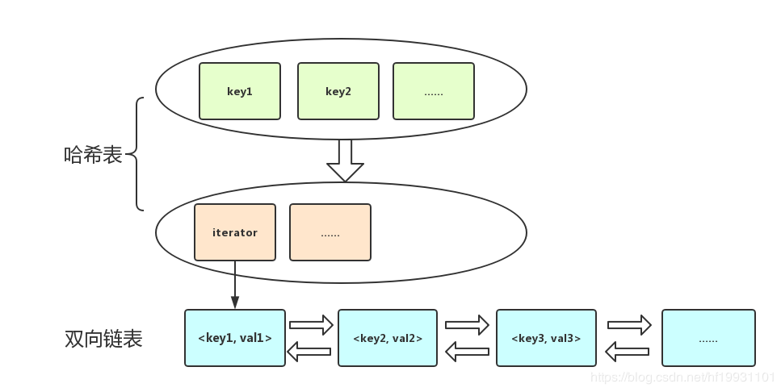
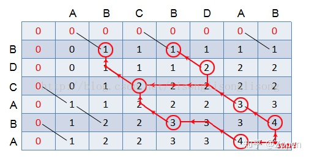
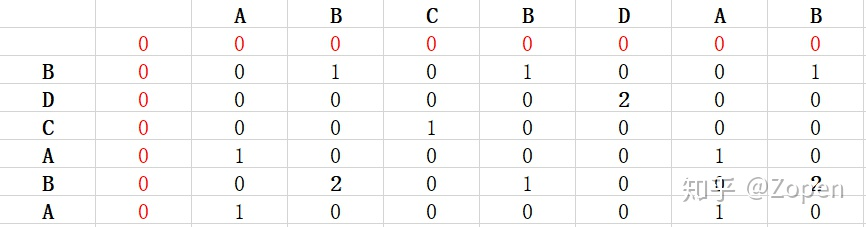
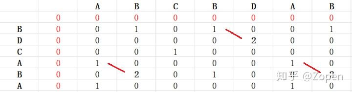

# 2_addTwoNumbers

List structure

```c++
// List node
struct ListNode {
    int val;
    ListNode *next;
    ListNode(int x) : val(x), next(NULL) {}
};

// Build list
ListNode* buildTree(vector<int>vec){
    ListNode* list = NULL;
    for (int i = int(vec.size()) - 1; i >= 0; i--) {
        ListNode* tmp = new ListNode(vec[i]);
        tmp->next = list;
        list = tmp;
    }
    return list;
}
```


## 11_maxArea

[剪枝正确性证明](https://leetcode-cn.com/problems/container-with-most-water/solution/zhi-guan-de-shuang-zhi-zhen-fa-jie-shi-by-na-kong/)

```c++
class Solution {
public:
    int maxArea(vector<int>& height) {
        int max_area = 0;
        int temp_area = 0;
        int start = 0;
        int end = int(height.size() - 1);
        
        while (start < end) {
            temp_area = (end - start) * min(height[start], height[end]);
            if (temp_area > max_area) {
                max_area = temp_area;
            }
            if (height[start] < height[end]) {
                start++;
            }else{
                end--;
            }
        }
        
        return max_area;
    }
};
```


## 34_searchRange


排序算法归纳

| 排序算法 | 平均时间复杂度 | 最佳情况        | 最坏情况        | 空间复杂度    | 排序方式  | 稳定性 |
| -------- | -------------- | --------------- | --------------- | ------------- | --------- | ------ |
| 冒泡     | $o(n^2)$       | $O(n)$          | $o(n^2)$        | $O(1)$        | In-place  | 稳定   |
| 选择     | $o(n^2)$       | $o(n^2)$        | $o(n^2)$        | $O(1)$        | In-place  | 不稳定 |
| 插入     | $o(n^2)$       | $O(n)$          | $o(n^2)$        | $O(1)$        | In-place  | 稳定   |
| 希尔     | $O(n\log{n})$  | $O(n\log^2{n})$ | $O(n\log^2{n})$ | $O(1)$        | In-place  | 不稳定 |
| 归并     | $O(n\log{n})$  | $O(n\log{n})$   | $O(n\log{n})$   | $O(n)$        | Out-place | 稳定   |
| 快速     | $O(n\log{n})$  | $O(n\log{n})$   | $o(n^2)$        | $O(n\log{n})$ | In-place  | 不稳定 |
| 堆       | $O(n\log{n})$  | $O(n\log{n})$   | $O(n\log{n})$   | $O(1)$        | In-place  | 不稳定 |


## 62_uniquePaths

```c++
// m*n的二维vector
vector<vector<int>> nums(m, vector<int>(n));
```


## 73_setZeroes

NaN ：阶码的每个二进制位全为1  并且  尾数不为0；

无穷：阶码的每个二进制位全为1  并且  尾数为0；符号位为0，是正无穷，符号位为1是负无穷。

```c++
//float
int __NaN=0xFFC00000,__Infinity=0x7F800000,__Neg_Infinity=0xFF800000;
const float NaN=*((float *)&__NaN),Infinity=*((float *)&__Infinity),Neg_Infinity=*((float *)&__Neg_Infinity); 


//double
__int64 __NaN=0xFFF8000000000000,__Infinity=0x7FF0000000000000,__Neg_Infinity=0xFFF0000000000000;
const double NaN=*((double *)&__NaN),Infinity=*((double *)&__Infinity),Neg_Infinity=*((double *)&__Neg_Infinity); 
```


## 89_grayCode

bitset的使用

```c++
#include <bitset>
// 初始化中size的设置必须是常量
const int size = sizeof(int);
bitset<size> bitvec0;
// 常量初始化
bitset<16> bitvec1(0xffff);
// string初始化
string str("1111111000000011001101");
bitset<32> bitvec2(str);
bitset<32> bitvec3(str, 5, 4); // 4 bits starting at str[5], 1100
bitset<32> bitvec4(str, str.size() - 4);     // use last 4 characters

// 每一位被存储为false或true，
bitvec0[0] = bitvec0[0] == false ? true : false;
cout<< bitvec0<<endl;
// bitset可以转换为ulong,ullong,string
result.push_back(int(bitvec0.to_ulong()));
```

| Function     | Info                                       |
| ------------ | ------------------------------------------ |
| b.any()      | b中是否存在置为1的二进制位？               |
| b.none()     | b中不存在置为1的二进制位吗？               |
| b.count()    | b中置为1的二进制位的个数                   |
| b.size()     | b中二进制位的个数                          |
| b[pos]       | 访问b中在pos处的二进制位                   |
| b.test(pos)  | b中在pos处的二进制位是否为1？              |
| b.set()      | 把b中所有二进制位都置为1                   |
| b.set(pos)   | 把b中在pos处的二进制位置为1                |
| b.reset()    | 把b中所有二进制位都置为0                   |
| b.reset(pos) | 把b中在pos处的二进制位置为0                |
| b.flip()     | 把b中所有二进制位逐位取反                  |
| b.flip(pos)  | 把b中在pos处的二进制位取反                 |
| b.to_ulong() | 用b中同样的二进制位返回一个unsigned long值 |
| os << b      | 把b中的位集输出到os流                      |

## 137_singleNumber

是136题的升级版。136题中，使用了异或运算的规则：

- 0与任意一个数字做一次异或运算，其值为该任意数字

- 0与任意一个数字做两次异或运算之后，其值仍为零

> 0 ^ 10 = 10
>
> 0 ^ 10 ^ 10 = 0

该规则是用异或运算的真值表决定的：

|      | 0    | 1    |
| ---- | ---- | ---- |
| 0    | 0    | 1    |
| 1    | 1    | 0    |

而本题中，需要另一种类似异或运算的规则。由此，我们可以设计这样一种规则（不是唯一的解决方案），我们需要两个变量M和N（初值均为0）来满足题目要求：

- M与任意一个数字做一次该运算，其值为该任意数字
- M和N与任意一个数字做三次该运算之后，其值仍为零

用s个bit的二进制来表示：$M=(m_1m_2\dots m_s)_2, N=(n_1n_2\dots n_s)_2$，$m_i$和$n_i$（初值均为0）的变化规则如下

- $m_i$与任意一个数字做3k+1(k>=0)次该运算，其值为该任意数字
- $m_i$和$n_i$与任意一个数字做3k(k>=0)次该运算之后，其值仍为零

|      | $m_i$ | $n_i$ | 备注                              |
| ---- | ----- | ----- | --------------------------------- |
| 0    | 0     | 0     | 初始状态，做$3\times 0=0$次该运算 |
| 1    | **1** | 0     | 做$3\times 0+1=1$次该运算         |
| 2    | 0     | 1     |                                   |
| 3    | 0     | 0     | 做$3\times 1=3$次该运算           |
| 4    | **1** | 0     | 做$3\times 1 + 1=4$次该运算       |
| 5    | 0     | 1     |                                   |
| 6    | 0     | 0     | 做$3\times 2=6$次该运算           |
| 7    | **1** | 0     | 做$3\times 2 + 1=7$次该运算       |
| ……   | ……    | ……    | ……                                |

由此，我们可以画出$m_i$和$n_i$的真值表，$(m_i', n_i')$表示变化结果，$num_i^k$表示vector数列中第k个数字的第i个bit

|                    | $num_i^k=0$          | $num_i^k=1$          |
| ------------------ | -------------------- | -------------------- |
| $(m_i, n_i)=(0,0)$ | $(m_i', n_i')=(0,0)$ | $(m_i', n_i')=(1,0)$ |
| $(m_i, n_i)=(1,0)$ | $(m_i', n_i')=(1,0)$ | $(m_i', n_i')=(0,1)$ |
| $(m_i, n_i)=(0,1)$ | $(m_i', n_i')=(0,1)$ | $(m_i', n_i')=(0,0)$ |

由真值表可得：
$$
m_i'=~n_i \& (m_i \land num_i^k)\\
n_i'=~m_i'\& (n_i \land num_i^k)
$$
其中$\land$表示异或运算，$\&$表示与运算。因此，该题答案如下：

```c++
class Solution {
public:
    int singleNumber(vector<int>& nums) {
        int M = 0;
        int N = 0;
        for (int k = 0; k < nums.size(); ++k) {
            M = (~N) & (M ^ nums[k]);
            N = (~M) & (N ^ nums[k]);
        }
        return M;
    }
};
```

## 146_LRUCache

linked hash map

- 在双向链表( std::list )中存放实际的KV对；
- 在哈希表( std::unordered_map )中存放Key到双向链表中的相应位置迭代器的映射。

在插入和遍历时，可以利用利用双向链表的灵活性，进行随机地插入元素，同时因其迭代器永不失效，所以可以作为哈希表中的value；查找时可以利用哈希表的特性，基于关键字key做平均常数时间复杂度的快速查找。



## 718_findLength

### 最长子序列 Longest Common Subsequence

子序列则只需保持相对顺序，并不要求连续

算法：动态规划

问题描述：给定两个序列：X[1...m]和Y[1...n]，求在两个序列中同时出现的最长子序列的长度

设C[i,j]表示序列X[1...i]和Y[1...j]的最长公共子序列的长度，则 C[m,n] 就是问题的解
$$
C[i, j]=\left\{\begin{array}{l}
C[i-1, j-1]+1 \quad \text { if } x[i]=y[i] \\
\max \{C[i, j-1], C[i-1, j]\} \quad \text { if } x[i]\neq y[i]
\end{array}\right.
$$


可以在 θ(mn) 的时间里求出 最长子序列 的长度

输出所有的最长公共子序列，需要在动态规划表上进行回溯 —— 从右下角的格子，开始进行判断：

1. 如果格子table\[i][j]对应的X[i-1] == Y[j-1]，则把这个字符放入 LCS 中，并跳入table\[i-1][j-1]中继续进行判断；
2. 如果格子table\[i][j]对应的 X[i-1] ≠ Y[j-1]，则比较table\[i-1][j]和table\[i][j-1]的值，跳入值较大的格子继续进行判断，如果出现table\[i-1][j]=table\[i][j-1]的情况，说明最长公共子序列有多个，故两边都要进行回溯（这里用到递归）
3. 直到 i 或 j 小于等于零为止，倒序输出 LCS



从上图的红色路径显示，X 和 Y 的最长公共子序列有 3 个，分别为 “BDAB”、“BCAB”、“BCBA”。

### 最长公共子数组/最长公共子串 Longest Common Substring

子串要求在原字符串中是连续的

求子串的方法和求子序列方法类似：
$$
S[i, j]=\left\{\begin{array}{l}
S[i-1, j-1]+1 \quad \text { if } x[i]=y[i] \\
0 \quad \text { if } x[i]\neq y[i]
\end{array}\right.
$$
下面是求解时的动态规划表，可以看出 X 和 Y 的最长公共子串的长度为2：



输出所有的最长公共子串需要判断table\[i][j]是否等于最长公共子串的长度，然后沿着对角线往左上角找大于等于1的数字即可



1. 如果table\[i][j] == lcs_len（lcs_len指最长公共子串长度），则把这个字符放入LCS中，并跳入table\[i-1][j-1]中继续进行判断；
2. 直到table\[i][j] < 1为止；倒序输出LCS放入set中。

从上图的红色路径显示，X 和 Y 的最长公共子串有 3 个，分别为 “BD”、“AB”、“AB”

因“AB”与“AB”重复，故只输出“BD”、“AB”即可

## Reference

- [STL bitset用法总结](http://www.cppblog.com/ylfeng/archive/2010/03/26/110592.aspx)
- [自定义C++容器之LinkedHashMap](https://blog.csdn.net/hf19931101/java/article/details/81979253)

- [最长公共子序列和最长公共子串](https://zhuanlan.zhihu.com/p/68409952)

