# 1_twoSum

Using multimap

```c++
// Header
#include <map>

// Defination
multimap<int, int>nums_map;

// Insert
// The map is already sorted by key during insert
for (int i = 0; i < nums.size(); ++i) {
		nums_map.insert(pair<int, int>(nums[i], i));
}        

// Iterator
multimap<int, int>::iterator i = nums_map.begin();
multimap<int, int>::iterator j = nums_map.end();
j--;

// first: key
// second: value
int sum = i->first + j->first;
result.push_back(i->second);
```


# 7_reverse

stringstream的用法

```c++
// 头文件
#include <sstream>

// int转string
stringstream s;
string str;
s << x;
s >> str;
string result_str;

// 清空
s.clear();

// string转long
long result_num;
s << result_str;
s >> result_num;
```


# 28_strStr

字符串匹配，主串"BBCMABCDABMABCDABCDABDE"里面是否包含子串"ABCDABD"

## KMP

> **B**BCMABCDABMABCDABCDABDE
>
> **A**BCDABD

首先，主串和子串的第一个字符对齐，不匹配，子串向后移一位

> B**B**CMABCDABMABCDABCDABDE
>
>   **A**BCDABD

依然不匹配，继续移动，直到主串和子串的第一个字符匹配

> BBCM**A**BCDABMABCDABCDABDE
>
> ​           **A**BCDABD

然后比较主串和子串的第二个字符

> BBCMA**B**CDABMABCDABCDABDE
>
> ​           A**B**CDABD

一直到主串和子串不匹配为止

> BBCMABCDAB**M**ABCDABCDABDE
>
> ​           ABCDAB**D**

按照蛮力法，这时候子串应该后移一位，但是效率很差。其实当M与D不匹配时，你其实知道前面六个字符是"ABCDAB"。KMP算法的想法是，设法利用这个已知信息，将子串多后移几个位置，这样就提高了效率。

那么，应该将子串后移几个位置呢？我们可以构造一个**部分匹配表**

### 部分匹配表

next 数组相当于“最大长度值” 整体向右移动一位，然后初始值赋为-1

| 部分匹配词     | A    | B    | C    | D    | A    | B    | D（必要时） |
| ---------- | ---- | ---- | ---- | ---- | ---- | ---- | ---- |
| 部分匹配值 | 0    | 0    | 0    | 0    | 1    | 2    |     |
| next数组 | -1 | 0 | 0 | 0 | 0 | 1 | 2 |

> BBCMABCDAB**M**ABCDABCDABDE
>
> ​           ABCDAB**D**

当M与D不匹配时，子串的上一个匹配的字符B对应的“部分匹配值”是2，移动位数为4：
$$
移动位数=已匹配的字符数-对应的部分匹配值=6-2=4
$$

> BBCMABCDAB**M**ABCDABCDABDE
>
> ​                     AB**C**DABD

M与C不匹配，子串的上一个匹配的字符B对应的“部分匹配值”是0，移动位数是2

> BBCMABCDAB**M**ABCDABCDABDE
>
> ​                          **A**BCDABD

M与A不匹配，后移一位

> BBCMABCDABM**A**BCDABCDABDE
>
> ​                             **A**BCDABD

继续比较，直到

> BBCMABCDABMABCDAB**C**DABDE
>
> ​                             ABCDAB**D**

C与D不匹配，子串的上一个匹配的字符B对应的“部分匹配值”是2，移动位数为4：

> BBCMABCDABMABCDAB**C**DABDE
>
> ​                                       AB**C**DABD

继续比较，直到子串完全匹配，搜索完成。如果还要继续搜索，需要移动7位

### 前后缀

“部分匹配值"就是"前缀"和"后缀"的最长的共有元素的长度

- "A"的前缀和后缀都为空集，共有元素的长度为0
- "AB"的前缀为[A]，后缀为[B]，共有元素的长度为0
- "ABC"的前缀为[A, AB]，后缀为[BC, C]，共有元素的长度0
- "ABCD"的前缀为[A, AB, ABC]，后缀为[BCD, CD, D]，共有元素的长度为0
- "ABCDA"的前缀为[A, AB, ABC, ABCD]，后缀为[BCDA, CDA, DA, A]，共有元素为"A"，长度为1
- "ABCDAB"的前缀为[A, AB, ABC, ABCD, ABCDA]，后缀为[BCDAB, CDAB, DAB, AB, B]，共有元素为"AB"，长度为2
- "ABCDABD"的前缀为[A, AB, ABC, ABCD, ABCDA, ABCDAB]，后缀为[BCDABD, CDABD, DABD, ABD, BD, D]，共有元素的长度为0

"部分匹配"的实质是，有时候，字符串头部和尾部会有重复。比如，"ABCDAB"之中有两个"AB"，那么它的"部分匹配值"就是2（"AB"的长度）。搜索词移动的时候，第一个"AB"向后移动4位（字符串长度-部分匹配值），就可以来到第二个"AB"的位置。

### next数组

计算next 数组的方法可以采用递推

https://www.cnblogs.com/yjiyjige/p/3263858.html

```c++
vector<int> buildNextVector(string needle){
        vector<int>next(needle.length());
        next[0] = -1;
        int k = -1;
        int j = 0; // 当前部分子串的索引
        while (j < needle.length() - 1) {
            if (k == -1 || needle[k] == needle[j]) {
                next[++j] = ++k;
            }else{
                k = next[k];
            }
        }
        return next;
    }
```

## Boyer-Moore算法

http://igm.univ-mlv.fr/~lecroq/string/node14.html

#  290_wordPattern

Find something in map by value

```c++
class finder
{
public:
    finder(const string &cmp_string) :s_(cmp_string){}
    bool operator ()(const map<int, string>::value_type &item)
    {
        return item.second == s_;
    }
private:
    const string &s_;
};

map<char, string> m;
string current = "2";
map<char, string>::iterator iter_2;
m['b'] = "2";
iter_2 = find_if(m.begin(), m.end(), finder(current));
```


# 697_findShortestSubArray

map sort by value

```
template <typename T1, typename T2>
struct great_second {
    typedef pair<T1, T2> type;
    bool operator ()(type const& a, type const& b) const {
        return a.second > b.second;
    }
};
int main(int argc, const char * argv[]) {
   map<int, int>m;        
   vector<pair<int, int> >mapcopy(m.begin(), m.end());
   sort(mapcopy.begin(), mapcopy.end(), great_second<int, int>());
   return 0;
}
```

# 2_addTwoNumbers

List structure

```c++
// List node
struct ListNode {
    int val;
    ListNode *next;
    ListNode(int x) : val(x), next(NULL) {}
};

// Build list
ListNode* buildTree(vector<int>vec){
    ListNode* list = NULL;
    for (int i = int(vec.size()) - 1; i >= 0; i--) {
        ListNode* tmp = new ListNode(vec[i]);
        tmp->next = list;
        list = tmp;
    }
    return list;
}
```


# 11_maxArea

[剪枝正确性证明](https://leetcode-cn.com/problems/container-with-most-water/solution/zhi-guan-de-shuang-zhi-zhen-fa-jie-shi-by-na-kong/)

```c++
class Solution {
public:
    int maxArea(vector<int>& height) {
        int max_area = 0;
        int temp_area = 0;
        int start = 0;
        int end = int(height.size() - 1);
        
        while (start < end) {
            temp_area = (end - start) * min(height[start], height[end]);
            if (temp_area > max_area) {
                max_area = temp_area;
            }
            if (height[start] < height[end]) {
                start++;
            }else{
                end--;
            }
        }
        
        return max_area;
    }
};
```


# 34_searchRange


排序算法归纳

| 排序算法 | 平均时间复杂度 | 最佳情况        | 最坏情况        | 空间复杂度    | 排序方式  | 稳定性 |
| -------- | -------------- | --------------- | --------------- | ------------- | --------- | ------ |
| 冒泡     | $o(n^2)$       | $O(n)$          | $o(n^2)$        | $O(1)$        | In-place  | 稳定   |
| 选择     | $o(n^2)$       | $o(n^2)$        | $o(n^2)$        | $O(1)$        | In-place  | 不稳定 |
| 插入     | $o(n^2)$       | $O(n)$          | $o(n^2)$        | $O(1)$        | In-place  | 稳定   |
| 希尔     | $O(n\log{n})$  | $O(n\log^2{n})$ | $O(n\log^2{n})$ | $O(1)$        | In-place  | 不稳定 |
| 归并     | $O(n\log{n})$  | $O(n\log{n})$   | $O(n\log{n})$   | $O(n)$        | Out-place | 稳定   |
| 快速     | $O(n\log{n})$  | $O(n\log{n})$   | $o(n^2)$        | $O(n\log{n})$ | In-place  | 不稳定 |
| 堆       | $O(n\log{n})$  | $O(n\log{n})$   | $O(n\log{n})$   | $O(1)$        | In-place  | 不稳定 |


# 62_uniquePaths

```c++
// m*n的二维vector
vector<vector<int>> nums(m, vector<int>(n));
```


# 73_setZeroes

NaN ：阶码的每个二进制位全为1  并且  尾数不为0；

无穷：阶码的每个二进制位全为1  并且  尾数为0；符号位为0，是正无穷，符号位为1是负无穷。

```c++
//float
int __NaN=0xFFC00000,__Infinity=0x7F800000,__Neg_Infinity=0xFF800000;
const float NaN=*((float *)&__NaN),Infinity=*((float *)&__Infinity),Neg_Infinity=*((float *)&__Neg_Infinity); 


//double
__int64 __NaN=0xFFF8000000000000,__Infinity=0x7FF0000000000000,__Neg_Infinity=0xFFF0000000000000;
const double NaN=*((double *)&__NaN),Infinity=*((double *)&__Infinity),Neg_Infinity=*((double *)&__Neg_Infinity); 
```


# 89_grayCode

bitset的使用

```c++
#include <bitset>
// 初始化中size的设置必须是常量
const int size = sizeof(int);
bitset<size> bitvec0;
// 常量初始化
bitset<16> bitvec1(0xffff);
// string初始化
string str("1111111000000011001101");
bitset<32> bitvec2(str);
bitset<32> bitvec3(str, 5, 4); // 4 bits starting at str[5], 1100
bitset<32> bitvec4(str, str.size() - 4);     // use last 4 characters

// 每一位被存储为false或true，
bitvec0[0] = bitvec0[0] == false ? true : false;
cout<< bitvec0<<endl;
// bitset可以转换为ulong,ullong,string
result.push_back(int(bitvec0.to_ulong()));
```

| Function     | Info                                       |
| ------------ | ------------------------------------------ |
| b.any()      | b中是否存在置为1的二进制位？               |
| b.none()     | b中不存在置为1的二进制位吗？               |
| b.count()    | b中置为1的二进制位的个数                   |
| b.size()     | b中二进制位的个数                          |
| b[pos]       | 访问b中在pos处的二进制位                   |
| b.test(pos)  | b中在pos处的二进制位是否为1？              |
| b.set()      | 把b中所有二进制位都置为1                   |
| b.set(pos)   | 把b中在pos处的二进制位置为1                |
| b.reset()    | 把b中所有二进制位都置为0                   |
| b.reset(pos) | 把b中在pos处的二进制位置为0                |
| b.flip()     | 把b中所有二进制位逐位取反                  |
| b.flip(pos)  | 把b中在pos处的二进制位取反                 |
| b.to_ulong() | 用b中同样的二进制位返回一个unsigned long值 |
| os << b      | 把b中的位集输出到os流                      |

# 137_singleNumber

是136题的升级版。136题中，使用了异或运算的规则：

- 0与任意一个数字做一次异或运算，其值为该任意数字

- 0与任意一个数字做两次异或运算之后，其值仍为零

> 0 ^ 10 = 10
>
> 0 ^ 10 ^ 10 = 0

该规则是用异或运算的真值表决定的：

|      | 0    | 1    |
| ---- | ---- | ---- |
| 0    | 0    | 1    |
| 1    | 1    | 0    |

而本题中，需要另一种类似异或运算的规则。由此，我们可以设计这样一种规则（不是唯一的解决方案），我们需要两个变量M和N（初值均为0）来满足题目要求：

- M与任意一个数字做一次该运算，其值为该任意数字
- M和N与任意一个数字做三次该运算之后，其值仍为零

用s个bit的二进制来表示：$M=(m_1m_2\dots m_s)_2, N=(n_1n_2\dots n_s)_2$，$m_i$和$n_i$（初值均为0）的变化规则如下

- $m_i$与任意一个数字做3k+1(k>=0)次该运算，其值为该任意数字
- $m_i$和$n_i$与任意一个数字做3k(k>=0)次该运算之后，其值仍为零

|      | $m_i$ | $n_i$ | 备注                              |
| ---- | ----- | ----- | --------------------------------- |
| 0    | 0     | 0     | 初始状态，做$3\times 0=0$次该运算 |
| 1    | **1** | 0     | 做$3\times 0+1=1$次该运算         |
| 2    | 0     | 1     |                                   |
| 3    | 0     | 0     | 做$3\times 1=3$次该运算           |
| 4    | **1** | 0     | 做$3\times 1 + 1=4$次该运算       |
| 5    | 0     | 1     |                                   |
| 6    | 0     | 0     | 做$3\times 2=6$次该运算           |
| 7    | **1** | 0     | 做$3\times 2 + 1=7$次该运算       |
| ……   | ……    | ……    | ……                                |

由此，我们可以画出$m_i$和$n_i$的真值表，$(m_i', n_i')$表示变化结果，$num_i^k$表示vector数列中第k个数字的第i个bit

|                    | $num_i^k=0$          | $num_i^k=1$          |
| ------------------ | -------------------- | -------------------- |
| $(m_i, n_i)=(0,0)$ | $(m_i', n_i')=(0,0)$ | $(m_i', n_i')=(1,0)$ |
| $(m_i, n_i)=(1,0)$ | $(m_i', n_i')=(1,0)$ | $(m_i', n_i')=(0,1)$ |
| $(m_i, n_i)=(0,1)$ | $(m_i', n_i')=(0,1)$ | $(m_i', n_i')=(0,0)$ |

由真值表可得：
$$
m_i'=~n_i \& (m_i \land num_i^k)\\
n_i'=~m_i'\& (n_i \land num_i^k)
$$
其中$\land$表示异或运算，$\&$表示与运算。因此，该题答案如下：

```c++
class Solution {
public:
    int singleNumber(vector<int>& nums) {
        int M = 0;
        int N = 0;
        for (int k = 0; k < nums.size(); ++k) {
            M = (~N) & (M ^ nums[k]);
            N = (~M) & (N ^ nums[k]);
        }
        return M;
    }
};
```

# 146_LRUCache

linked hash map

- 在双向链表( std::list )中存放实际的KV对；
- 在哈希表( std::unordered_map )中存放Key到双向链表中的相应位置迭代器的映射。

在插入和遍历时，可以利用利用双向链表的灵活性，进行随机地插入元素，同时因其迭代器永不失效，所以可以作为哈希表中的value；查找时可以利用哈希表的特性，基于关键字key做平均常数时间复杂度的快速查找。

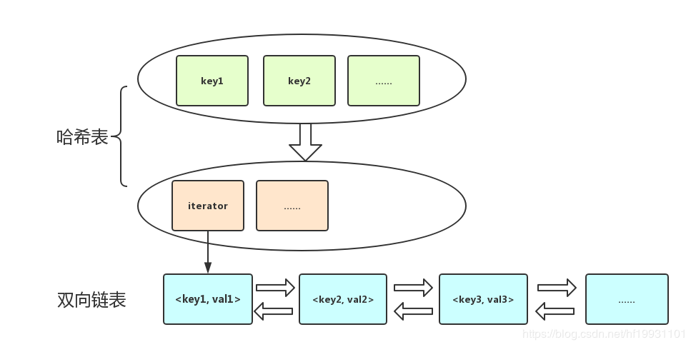

# 718_findLength

## 最长子序列 Longest Common Subsequence

子序列则只需保持相对顺序，并不要求连续

算法：动态规划

问题描述：给定两个序列：X[1...m]和Y[1...n]，求在两个序列中同时出现的最长子序列的长度

设C[i,j]表示序列X[1...i]和Y[1...j]的最长公共子序列的长度，则 C[m,n] 就是问题的解
$$
C[i, j]=\left\{\begin{array}{l}
C[i-1, j-1]+1 \quad \text { if } x[i]=y[i] \\
\max \{C[i, j-1], C[i-1, j]\} \quad \text { if } x[i]\neq y[i]
\end{array}\right.
$$
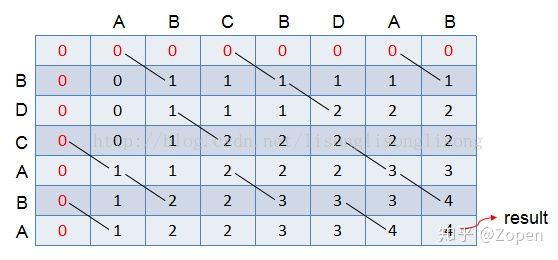

可以在 θ(mn) 的时间里求出 最长子序列 的长度

输出所有的最长公共子序列，需要在动态规划表上进行回溯 —— 从右下角的格子，开始进行判断：

1. 如果格子table\[i][j]对应的X[i-1] == Y[j-1]，则把这个字符放入 LCS 中，并跳入table\[i-1][j-1]中继续进行判断；
2. 如果格子table\[i][j]对应的 X[i-1] ≠ Y[j-1]，则比较table\[i-1][j]和table\[i][j-1]的值，跳入值较大的格子继续进行判断，如果出现table\[i-1][j]=table\[i][j-1]的情况，说明最长公共子序列有多个，故两边都要进行回溯（这里用到递归）
3. 直到 i 或 j 小于等于零为止，倒序输出 LCS

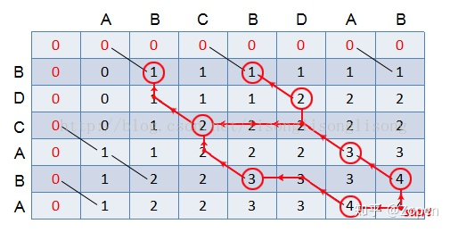

从上图的红色路径显示，X 和 Y 的最长公共子序列有 3 个，分别为 “BDAB”、“BCAB”、“BCBA”。

## 最长公共子数组/最长公共子串 Longest Common Substring

子串要求在原字符串中是连续的

求子串的方法和求子序列方法类似：
$$
S[i, j]=\left\{\begin{array}{l}
S[i-1, j-1]+1 \quad \text { if } x[i]=y[i] \\
0 \quad \text { if } x[i]\neq y[i]
\end{array}\right.
$$
下面是求解时的动态规划表，可以看出 X 和 Y 的最长公共子串的长度为2：

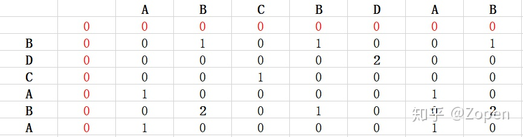

输出所有的最长公共子串需要判断table\[i][j]是否等于最长公共子串的长度，然后沿着对角线往左上角找大于等于1的数字即可

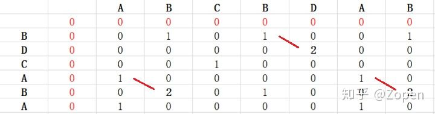

1. 如果table\[i][j] == lcs_len（lcs_len指最长公共子串长度），则把这个字符放入LCS中，并跳入table\[i-1][j-1]中继续进行判断；
2. 直到table\[i][j] < 1为止；倒序输出LCS放入set中。

从上图的红色路径显示，X 和 Y 的最长公共子串有 3 个，分别为 “BD”、“AB”、“AB”

因“AB”与“AB”重复，故只输出“BD”、“AB”即可

# 315_countSmaller

## 树状数组

树状数组是用数组来模拟树形结构，可以解决大部分基于区间上的更新以及求和问题。树状数组中修改和查询的复杂度都是O(logN)

黑色数组代表原来的数组（下面用A[i]代替），红色树代表我们的树状数组(下面用C[i]代替)。树状数组每个位置只有一个方框，令每个位置存的就是子节点的值的和：

- C[1] = A[1];
- C[2] = A[1] + A[2];
- C[3] = A[3];
- C[4] = A[1] + A[2] + A[3] + A[4];
- C[5] = A[5];
- C[6] = A[5] + A[6];
- C[7] = A[7];
- C[8] = A[1] + A[2] + A[3] + A[4] + A[5] + A[6] + A[7] + A[8];


这颗树是有规律的：
$$
C[i] = A[i - 2^k+1] + A[i - 2^k+2] + ... + A[i]
$$
k为i的二进制中从最低位到高位连续零的长度

比如：
$$
4=(100)_2\\
C[4] = A[4 - 2^2+1] + A[4 - 2^2+2] + ... + A[4]=A[1]+A[2]+A[3]+A[4]
$$
那么怎么实现求和呢，比如我们要找前7项和，那么应该是$SUM_7 = C[7] + C[6] + C[4]$;

也就是：
$$
\begin{align}
SUM_7&= C[7] + C[7-2^{k_1}] + C[(7 - 2^{k_1}) - 2^{k_2}] + C[(7 - 2^{k_1}) - 2^{k_2}] + \dots\\
&= C[7] + C[7-2^{0}] + C[(7 - 2^{0}) - 2^{1}] + C[(7 - 2^{0}) - 2^{1}- 2^{2}]\\
&=C[7] + C[6] + C[4]
\end{align}
$$

其中C[0]=0

- $k_1$为7的二进制中从最低位到高位连续零的长度
- $k_2$为6的二进制中从最低位到高位连续零的长度
- $k_3$为4的二进制中从最低位到高位连续零的长度

$$
\begin{align}
SUM_i &= C[i] + C[i-2^{k_1}] + C[(i - 2^{k_1}) - 2^{k_2}] + \dots\\
\end{align}
$$

其中$k_1$是i的二进制中从最低位到高位连续零的长度，$k_2$是$i-2^{k_1}$的二进制中从最低位到高位连续零的长度，以此类推

### lowbit计算

那么i的二进制中从最低位到高位连续零的长度（称为lowbit） $2^k$该怎么求呢？可以用如下的公式：
$$
2^k = i\&(i\oplus({i-1}))
$$
解释：
$$
\begin{align}
i&=000001101\overbrace{000}^{k个0}\\
i-1&=000001100\overbrace{111}^{k个1}\\
i\oplus({i-1})&=00000000\overbrace{1111}^{k+1个1}\\
i\&(i\oplus({i-1}))&=000000001\overbrace{000}^{k个0}=2^k
\end{align}
$$
另一种更简单的公式：
$$
2^k = i\&(-i)
$$
该公式利用了负数的存储特性，负数是以补码存储的

> 原码、反码、补码是为了表示负数而提出的
>
> 原码：把左边第一位腾出位置，存放符号，正用0来表示，负用1来表示。但原码不能满足正负相加等于0
>
> 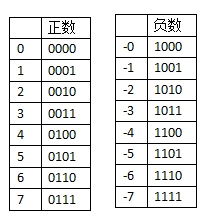
>
> 反码：符号位置不变，其余位与原码相反。但反码的0存在+0和-0两种
>
> 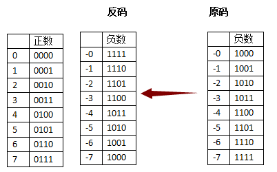
>
> 补码：从反码的基础上加1
>
> 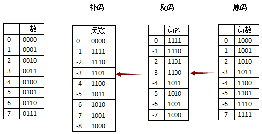

对于整数运算 x&(-x)有

- 当x为0时，即 0 & 0，结果为0；

- 当x为奇数时，最后一个比特位为1，取反加1没有进位，故x和-x除最后一位外前面的位正好相反，按位与结果为0。结果为1。
  $$
  \begin{align}
  x&=00011101\\
  -x&=11100011\\
  x\&(-x)&=00000001
  \end{align}
  $$

- 当x为偶数，且为2的m次方时，x的二进制表示中只有一位是1（从右往左的第m+1位），其右边有m位0，第m+1位及其左边全是1。这样，x& (-x) 得到的就是x
  $$
  \begin{align}
  x&=00001000\\
  -x&=11111000\\
  x\&(-x)&=00001000
  \end{align}
  $$
  
- 当x为偶数，却不为2的m次方的形式时，可以写作$x= y \times (2^k)$。其中，y的最低位为1。实际上就是把x用一个奇数左移k位来表示。这时，x的二进制表示最右边有k个0，从右往左第k+1位为1。当对x取反时，最右边的k位0变成1，第k+1位变为0；再加1，最右边的k位就又变成了0，第k+1位因为进位的关系变成了1。左边的位因为没有进位，正好和x原来对应的位上的值相反。二者按位与，得到：第k+1位上为1，左边右边都为0。结果为$2^k$
  $$
  \begin{align}
  x&=00011010\\
  -x&=11100110\\
  x\&(-x)&=00000010
  \end{align}
  $$

总结一下：x&(-x)

- 当x为0时结果为0
- x为奇数时，结果为1
- x为偶数时，结果为x中2的最大次方的因子，即$2^k$

而且这个有一个专门的称呼，叫做lowbit，即取$2^k$

### 更新操作

上面已经解释了如何用树状数组求区间和，那么如果我们要更新某一个点的值呢

如果我们更新某个A[i]的值，则会影响到所有包含有A[i]的位置，A[i]包含于：
$$
C[i]、C[i + 2^{k_1}]、C[(i + 2^{k_1}) + 2^{k_2}]\dots
$$
其中$k_1$是i的lowbit，$k_2$是$i+2^{k_1}$的lowbit，以此类推

比如A[1]包含于：
$$
C[1]、C[1+2^{k_1}]、C[1+2^{k_1}+2^{k_2}]\dots\\
C[1]、C[1+2^0]、C[1+2^0+2^1]\dots\\
C[1]、C[2]、C[4]\dots
$$

## 问题分析

假设输入的整数数组 nums=[7, 5, 6, 5, 2, 6, 5, 1]，输出的计数数组（**`nums[i]`** 右侧小于 **`nums[i]`** 的元素的数量）初始化为counts=[?,?,?,?,?,?,?,?]，对nums进行排序和去重得到数组N[i]

接下来我们从nums的右边向左边遍历，统计“当前遇到数字的出现次数”的数组A[i]（如下表）：

初始情况出现次数均为0，并且数字按照从小到大排序

| 数字N[i]     | 1    | 2    | 5    | 6    | 7    |
| ------------ | ---- | ---- | ---- | ---- | ---- |
| 出现次数A[i] | 0    | 0    | 0    | 0    | 0    |

第一个遇到数字1，将数字1的出现次数+1，然后计算下表中小于1的数字的出现次数（这里没有比1小的，次数为0），然后用这个出现次数更新counts中数字1对应的位置，counts=[?,?,?,?,?,?,?,0]

| 数字N[i]     | 1    | 2    | 5    | 6    | 7    |
| ------------ | ---- | ---- | ---- | ---- | ---- |
| 出现次数A[i] | 1    | 0    | 0    | 0    | 0    |

第二个遇到数字5，将数字5的出现次数+1，然后计算下表中小于1的数字的出现次数（也就是下表中数字5左边所有数字出现次数总和，次数为1），然后用这个出现次数更新counts中数字5对应的位置，counts=[?,?,?,?,?,?,1,0]

| 数字N[i]     | 1    | 2    | 5    | 6    | 7    |
| ------------ | ---- | ---- | ---- | ---- | ---- |
| 出现次数A[i] | 1    | 0    | 1    | 0    | 0    |

第三个遇到数字6，将数字6的出现次数+1，然后计算下表中小于6的数字的出现次数（也就是下表中数字6左边所有数字出现次数总和，次数为2），然后用这个出现次数更新counts中数字6对应的位置，counts=[?,?,?,?,?,2,1,0]

| 数字N[i]     | 1    | 2    | 5    | 6    | 7    |
| ------------ | ---- | ---- | ---- | ---- | ---- |
| 出现次数A[i] | 1    | 0    | 1    | 1    | 0    |

第四个遇到数字2，将数字2的出现次数+1，然后计算下表中小于2的数字的出现次数（也就是下表中数字2左边所有数字出现次数总和，次数为1），然后用这个出现次数更新counts中数字2对应的位置，counts=[?,?,?,?,1,2,1,0]

| 数字N[i]     | 1    | 2    | 5    | 6    | 7    |
| ------------ | ---- | ---- | ---- | ---- | ---- |
| 出现次数A[i] | 1    | 1    | 1    | 1    | 0    |

以此类推，最终我们可以得到，counts=[7,2,4, 2,1,2,1,0]

| 数字     | 1    | 2    | 5    | 6    | 7    |
| -------- | ---- | ---- | ---- | ---- | ---- |
| 出现次数 | 1    | 1    | 3    | 1    | 1    |

这个方法可以得到答案，但复杂度较高

## 树状数组解决方法

可以利用树状数组，简化“数字k左边所有数字出现次数总和”这一步

将上面表格中的数组A[i]作为树状数组的A[i]，然后记录计算C[i]，再根据$SUM_i$的计算方法求counts数组

同样的，假设输入的整数数组 nums=[7, 5, 6, 5, 2, 6, 5, 1]，输出的计数数组初始化为counts=[?,?,?,?,?,?,?,?]

对nums进行排序和去重，得到N[i]=[1, 2, 5, 6, 7]，如下图所示

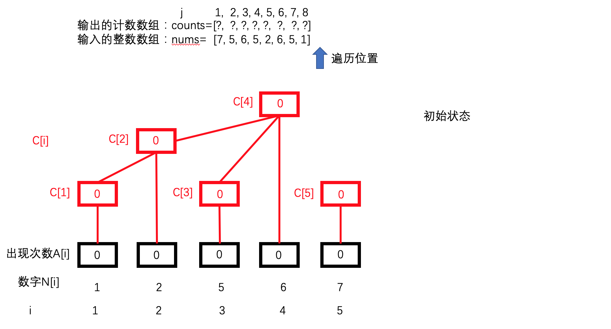

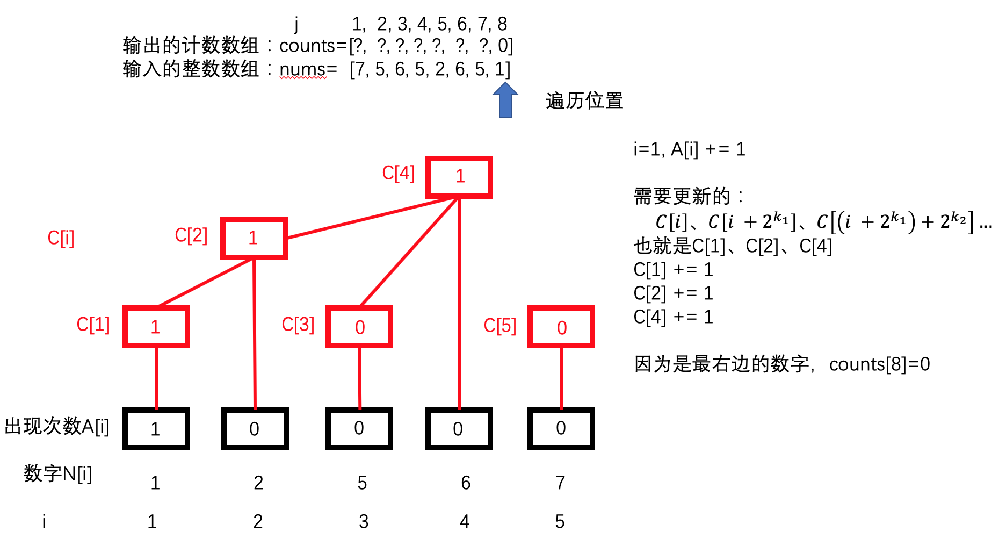

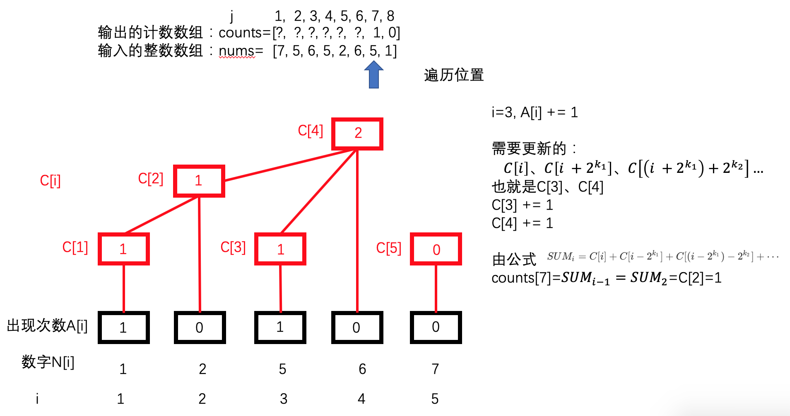

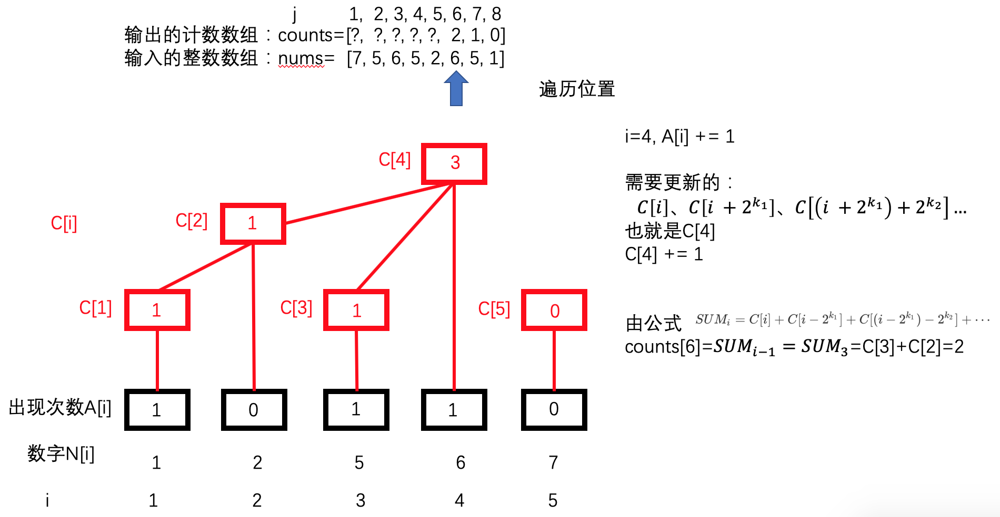

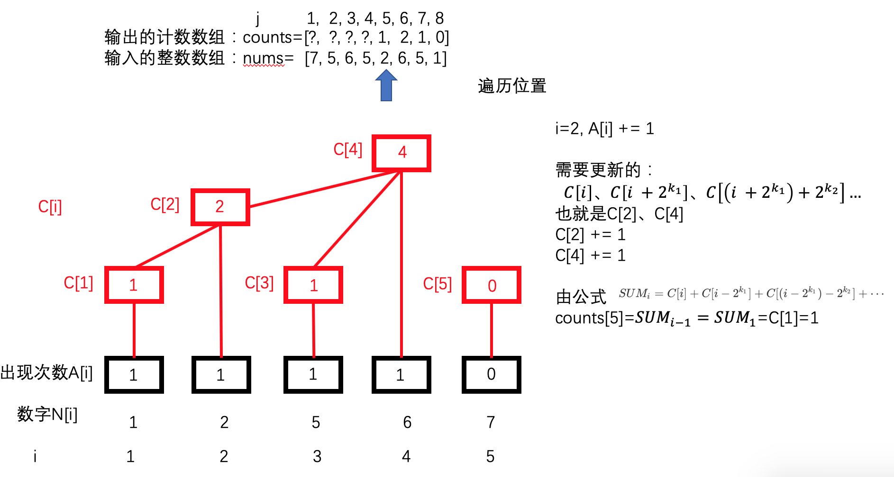

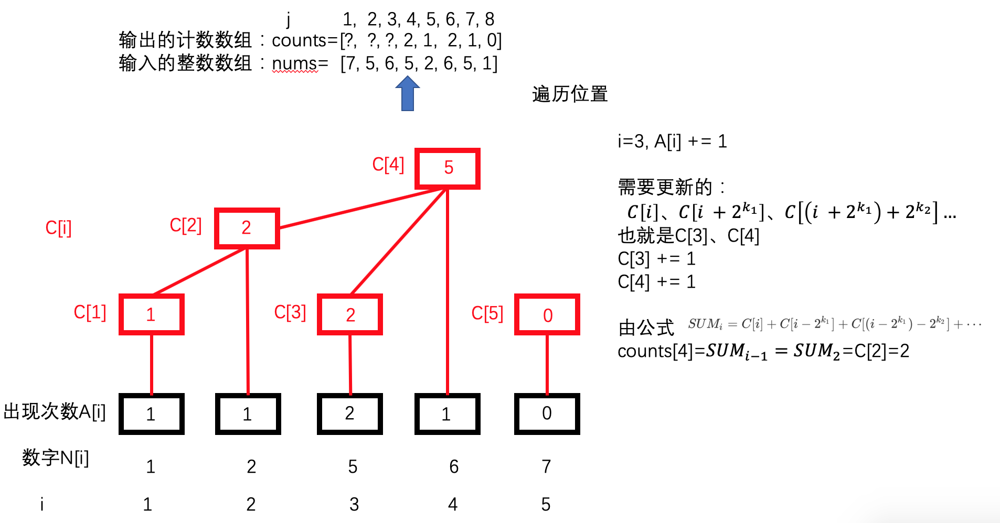

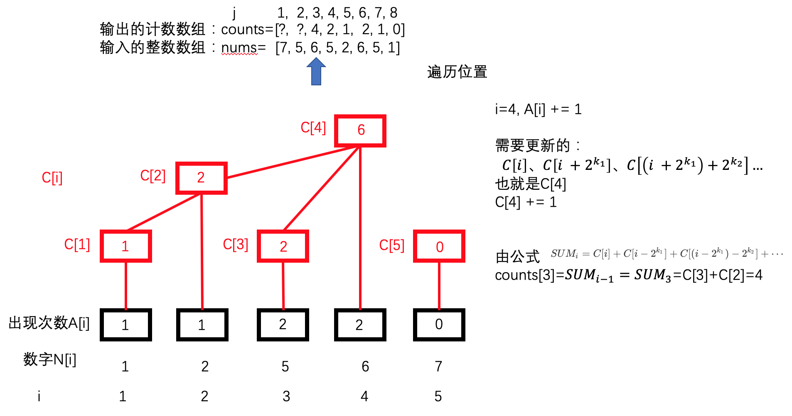

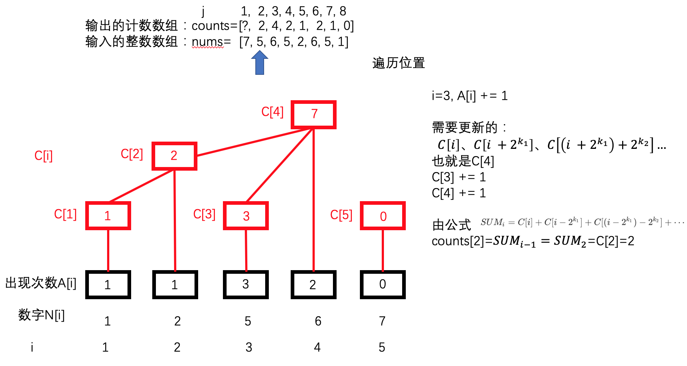


# 785_isBipartite

状态存储：广度优先是用队列，深度优先是用栈

# Reference

- [STL bitset用法总结](http://www.cppblog.com/ylfeng/archive/2010/03/26/110592.aspx)
- [自定义C++容器之LinkedHashMap](https://blog.csdn.net/hf19931101/java/article/details/81979253)
- [最长公共子序列和最长公共子串](https://zhuanlan.zhihu.com/p/68409952)
- [树状数组详解](https://www.cnblogs.com/xenny/p/9739600.html)
- [原码、反码、补码的产生、应用以及优缺点有哪些](https://www.zhihu.com/question/20159860/answer/71256667)

